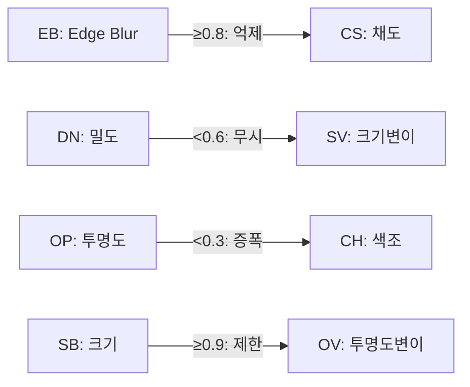
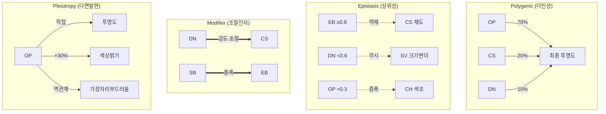

# 10-Gene Dot Phenotype System - Advanced Genetic Mechanisms

점(Spot) 패턴 형성 로직은 변경하지 않으면서, 점의 **흐린 정도**, **색상**, **크기** 등 시각적 속성을 10개의 유전인자가 **생물학적으로 현실적인 유전 메커니즘**을 통해 유기적으로 조절하는 시스템.

---

## 1. Gene Definitions (10개 유전인자)

각 유전자는 두 개의 **대립유전자(Alleles)**를 가지며, 각 대립유전자는 `0.0 ~ 1.0` 범위의 값을 가집니다.

| # | Gene ID | Korean | Role | Allele Range |
|---|---------|--------|------|--------------|
| 1 | `OP` | 투명도 기본 | 점의 기본 불투명도 | 0.0 ~ 1.0 |
| 2 | `OV` | 투명도 변이 | 투명도 변동 폭 | 0.0 ~ 1.0 |
| 3 | `CH` | 색상 색조 | Hue 오프셋 | 0.0 ~ 1.0 |
| 4 | `CS` | 색상 채도 | 채도 조절 | 0.0 ~ 1.0 |
| 5 | `SB` | 크기 기본 | 크기 배율 | 0.0 ~ 1.0 (→ 0.5x ~ 2.0x) |
| 6 | `SV` | 크기 변이 | 크기 변동 폭 | 0.0 ~ 1.0 |
| 7 | `EB` | 가장자리 흐림 | 경계 부드러움 | 0.0 ~ 1.0 |
| 8 | `DN` | 밀도 조절 | 렌더링 확률 | 0.0 ~ 1.0 (→ 50% ~ 100%) |
| 9 | `PX` | 위치 편향 X | 좌우 분포 | 0.0 ~ 1.0 (→ -0.5 ~ 0.5) |
| 10 | `PY` | 위치 편향 Y | 전후 분포 | 0.0 ~ 1.0 (→ -0.5 ~ 0.5) |

---

## 2. Advanced Genetic Mechanisms

### 2.1 다인성 유전 (Polygenic Inheritance)

여러 유전자가 하나의 표현형에 함께 기여합니다.

```typescript
// 최종 투명도 = OP의 영향 70% + CS(채도)의 영향 20% + DN(밀도)의 영향 10%
const finalOpacity = 
    expressedOP * 0.70 + 
    expressedCS * 0.20 + 
    expressedDN * 0.10;
```

**다인성 조합:**
| 표현형 | 관여 유전자 | 가중치 |
|--------|------------|--------|
| 최종 투명도 | OP(70%), CS(20%), DN(10%) | 합산 |
| 최종 크기 | SB(60%), OP(20%), EB(20%) | 합산 |
| 색상 선명도 | CS(50%), EB(30%), OP(20%) | 곱셈 |

---

### 2.2 상위성 (Epistasis)

한 유전자가 다른 유전자의 발현을 억제하거나 변경합니다.

```typescript
// 열성 상위성: EB(Edge Blur) 값이 0.8 이상이면 CS(채도)가 억제됨
const isEBEpistatic = expressedEB > 0.8;
const effectiveCS = isEBEpistatic ? expressedCS * 0.3 : expressedCS;

// 우성 상위성: DN(밀도)가 0.6 미만이면 SV(크기 변이)가 무시됨
const isDNDominant = expressedDN < 0.6;
const effectiveSV = isDNDominant ? 0 : expressedSV;
```

**상위성 관계:**


---

### 2.3 우성/열성 (Dominance Patterns)

각 유전자는 다른 우성/열성 패턴을 가집니다.

| Gene | Dominance Type | Expression Rule |
|------|----------------|-----------------|
| OP | **불완전 우성** | 평균값 (blend) |
| OV | **열성** | 두 대립유전자 모두 높을 때만 발현 |
| CH | **공우성** | 두 값 모두 부분 발현 (모자이크) |
| CS | **완전 우성** | 높은 값이 발현 |
| SB | **불완전 우성** | 평균값 |
| SV | **열성** | 두 대립유전자 모두 높을 때만 발현 |
| EB | **완전 우성** | 높은 값이 발현 |
| DN | **불완전 우성** | 평균값 |
| PX | **공우성** | 두 값의 복합 효과 |
| PY | **공우성** | 두 값의 복합 효과 |

```typescript
const expressGene = (allele1: number, allele2: number, dominanceType: DominanceType): number => {
    switch (dominanceType) {
        case 'complete':      // 완전 우성
            return Math.max(allele1, allele2);
        case 'incomplete':    // 불완전 우성
            return (allele1 + allele2) / 2;
        case 'recessive':     // 열성: 둘 다 높아야 발현
            return Math.min(allele1, allele2);
        case 'codominance':   // 공우성: 복합 효과
            return allele1 * 0.5 + allele2 * 0.5 + Math.abs(allele1 - allele2) * 0.2;
        default:
            return (allele1 + allele2) / 2;
    }
};
```

---

### 2.4 조절 유전자 (Modifier Genes)

특정 유전자가 다른 유전자의 발현 **정도**를 조절합니다.

```typescript
// DN(밀도)이 CS(채도) 발현 강도를 조절
const csModifier = 0.5 + expressedDN * 0.5; // 50% ~ 100%
const modifiedCS = expressedCS * csModifier;

// SB(크기)가 EB(흐림) 효과를 증폭
const ebAmplifier = 1.0 + (expressedSB - 0.5) * 0.6; // 0.7x ~ 1.3x
const amplifiedEB = expressedEB * ebAmplifier;
```

**조절 관계:**
| Modifier Gene | Target Gene | Effect |
|---------------|-------------|--------|
| DN | CS | 발현 강도 50%~100% |
| SB | EB | 효과 증폭 0.7x~1.3x |
| OP | CH | Hue 변동 범위 조절 |
| CS | OV | 변이 폭 제한 |

---

### 2.5 다면발현 (Pleiotropy)

한 유전자가 여러 표현형에 영향을 미칩니다.

```typescript
// OP(투명도)가 여러 속성에 영향
const opEffects = {
    opacity: expressedOP,                    // 직접 효과
    colorBrightness: expressedOP * 0.3,     // 색상 밝기 +30%
    edgeSoftness: (1 - expressedOP) * 0.2,  // 역관계: 투명할수록 가장자리 부드러움
};

// SB(크기)의 다면발현
const sbEffects = {
    spotSize: expressedSB,                   // 직접 효과
    densityPenalty: expressedSB > 0.8 ? -0.1 : 0, // 큰 점은 밀도 감소
    blurBonus: expressedSB * 0.15,          // 큰 점은 약간 흐릿
};
```

---

### 2.6 연관 유전 (Genetic Linkage)

특정 유전자 쌍이 함께 유전될 확률이 높습니다.

```typescript
const LINKAGE_GROUPS = [
    { genes: ['OP', 'OV'], linkageStrength: 0.7 },  // 70% 함께 유전
    { genes: ['CH', 'CS'], linkageStrength: 0.8 },  // 80% 함께 유전
    { genes: ['SB', 'SV'], linkageStrength: 0.6 },  // 60% 함께 유전
    { genes: ['PX', 'PY'], linkageStrength: 0.9 },  // 90% 함께 유전
];
```

---

### 2.7 환경적 발현 변이 (Environmental Variance)

유전자 발현이 환경 요인(나이, 건강)에 영향받습니다.

```typescript
const getEnvironmentalModifier = (koi: Koi): number => {
    const ageFactor = koi.growthStage === 'adult' ? 1.0 : 
                      koi.growthStage === 'juvenile' ? 0.85 : 0.7;
    const healthFactor = (koi.stamina ?? 100) / 100;
    return ageFactor * healthFactor;
};

// 최종 표현형 = 유전적 표현형 × 환경 조절자
const finalPhenotype = geneticPhenotype * getEnvironmentalModifier(koi);
```

---

## 3. Complex Breeding System

### 3.1 감수분열 시뮬레이션 (Meiosis Simulation)

```typescript
interface Allele {
    value: number;
    origin: 'maternal' | 'paternal';
}

interface GeneAlleles {
    allele1: Allele;
    allele2: Allele;
}

const performMeiosis = (parentGenes: Record<string, GeneAlleles>): Record<string, Allele> => {
    const gamete: Record<string, Allele> = {};
    
    // 각 유전자마다 50% 확률로 allele1 또는 allele2 선택
    for (const [geneId, alleles] of Object.entries(parentGenes)) {
        // 연관 유전 확인
        const linkedGene = getLinkagePartner(geneId);
        
        if (linkedGene && gamete[linkedGene]) {
            // 연관된 유전자가 이미 선택됨 → 연관 확률 적용
            const linkageStrength = getLinkageStrength(geneId, linkedGene);
            if (Math.random() < linkageStrength) {
                // 같은 origin의 allele 선택
                const linkedOrigin = gamete[linkedGene].origin;
                gamete[geneId] = linkedOrigin === 'maternal' ? alleles.allele1 : alleles.allele2;
                continue;
            }
        }
        
        // 독립적 분리
        gamete[geneId] = Math.random() < 0.5 ? alleles.allele1 : alleles.allele2;
    }
    
    return gamete;
};
```

### 3.2 교차 (Crossing Over)

```typescript
const CROSSOVER_RATE = 0.15; // 15% 교차 확률

const applyCrossover = (gamete: Record<string, Allele>): Record<string, Allele> => {
    const result = { ...gamete };
    
    for (const linkageGroup of LINKAGE_GROUPS) {
        if (Math.random() < CROSSOVER_RATE) {
            // 교차 발생: 연관 그룹 내 유전자들의 origin 교환
            const [gene1, gene2] = linkageGroup.genes;
            if (result[gene1] && result[gene2]) {
                // Swap origins
                const temp = result[gene1].origin;
                result[gene1] = { ...result[gene1], origin: result[gene2].origin };
                result[gene2] = { ...result[gene2], origin: temp };
            }
        }
    }
    
    return result;
};
```

### 3.3 돌연변이 시스템 (Mutation System)

```typescript
interface MutationConfig {
    type: 'point' | 'deletion' | 'duplication' | 'inversion';
    rate: number;
    magnitude: number;
}

const MUTATION_CONFIGS: Record<string, MutationConfig> = {
    OP: { type: 'point', rate: 0.02, magnitude: 0.15 },
    OV: { type: 'point', rate: 0.03, magnitude: 0.20 },
    CH: { type: 'point', rate: 0.05, magnitude: 0.25 }, // 색상은 변이 잦음
    CS: { type: 'point', rate: 0.03, magnitude: 0.15 },
    SB: { type: 'point', rate: 0.02, magnitude: 0.10 },
    SV: { type: 'point', rate: 0.04, magnitude: 0.20 },
    EB: { type: 'point', rate: 0.02, magnitude: 0.15 },
    DN: { type: 'deletion', rate: 0.01, magnitude: 0.30 }, // 밀도는 큰 변화
    PX: { type: 'point', rate: 0.03, magnitude: 0.15 },
    PY: { type: 'point', rate: 0.03, magnitude: 0.15 },
};

const applyMutation = (allele: Allele, config: MutationConfig): Allele => {
    if (Math.random() > config.rate) return allele;
    
    let newValue = allele.value;
    
    switch (config.type) {
        case 'point':
            // 작은 변화
            newValue += (Math.random() - 0.5) * 2 * config.magnitude;
            break;
        case 'deletion':
            // 값 감소
            newValue *= (1 - config.magnitude);
            break;
        case 'duplication':
            // 값 증가
            newValue *= (1 + config.magnitude);
            break;
        case 'inversion':
            // 값 반전
            newValue = 1 - newValue;
            break;
    }
    
    return { value: Math.max(0, Math.min(1, newValue)), origin: allele.origin };
};
```

### 3.4 유전적 드리프트 (Genetic Drift)

세대가 지남에 따라 작은 무작위 변화가 누적됩니다.

```typescript
const DRIFT_RATE = 0.005; // 0.5% 드리프트

const applyDrift = (allele: Allele): Allele => {
    const drift = (Math.random() - 0.5) * 2 * DRIFT_RATE;
    return { 
        value: Math.max(0, Math.min(1, allele.value + drift)), 
        origin: allele.origin 
    };
};
```

### 3.5 근친 교배 페널티 (Inbreeding Depression)

```typescript
const calculateInbreedingCoefficient = (parent1: Koi, parent2: Koi): number => {
    // 부모가 같은 유전자 값을 많이 공유할수록 높은 계수
    let similarity = 0;
    const genes1 = parent1.genetics.spotPhenotypeGenes;
    const genes2 = parent2.genetics.spotPhenotypeGenes;
    
    for (const geneId of Object.keys(genes1)) {
        const diff = Math.abs(expressGene(genes1[geneId]) - expressGene(genes2[geneId]));
        similarity += (1 - diff);
    }
    
    return similarity / 10; // 0.0 ~ 1.0
};

const applyInbreedingPenalty = (offspring: GeneAlleles, coefficient: number): GeneAlleles => {
    // 높은 근친 계수일수록 변이 폭 증가, 극단값으로 이동
    if (coefficient > 0.7) {
        const penalty = (coefficient - 0.7) * 2; // 0 ~ 0.6
        // 유해 돌연변이 확률 증가
        if (Math.random() < penalty) {
            offspring.allele1.value *= (1 - penalty * 0.3);
        }
    }
    return offspring;
};
```

---

## 4. Data Structure Changes

### types.ts

```typescript
// 우성 유형
export enum DominanceType {
    COMPLETE = 'complete',           // 완전 우성
    INCOMPLETE = 'incomplete',       // 불완전 우성
    RECESSIVE = 'recessive',         // 열성
    CODOMINANCE = 'codominance',     // 공우성
}

// 대립유전자
export interface Allele {
    value: number;                   // 0.0 ~ 1.0
    origin: 'maternal' | 'paternal';
}

// 유전자 쌍
export interface GeneAlleles {
    allele1: Allele;
    allele2: Allele;
    dominanceType: DominanceType;
}

// 10개 유전자 시스템
export interface SpotPhenotypeGenes {
    OP: GeneAlleles;  // Opacity Base
    OV: GeneAlleles;  // Opacity Variance
    CH: GeneAlleles;  // Color Hue
    CS: GeneAlleles;  // Color Saturation
    SB: GeneAlleles;  // Size Base
    SV: GeneAlleles;  // Size Variance
    EB: GeneAlleles;  // Edge Blur
    DN: GeneAlleles;  // Density
    PX: GeneAlleles;  // Position Bias X
    PY: GeneAlleles;  // Position Bias Y
}

// 표현형 (발현된 값)
export interface SpotPhenotype {
    opacityBase: number;
    opacityVariance: number;
    colorHue: number;
    colorSaturation: number;
    sizeBase: number;
    sizeVariance: number;
    edgeBlur: number;
    density: number;
    positionBiasX: number;
    positionBiasY: number;
}

// KoiGenetics 확장
export interface KoiGenetics {
    baseColorGenes: GeneType[];
    spots: Spot[];
    lightness: number;
    isTransparent: boolean;
    spotPhenotypeGenes: SpotPhenotypeGenes;  // 유전자형 (저장)
    // spotPhenotype은 계산되므로 저장 불필요 (getter로 처리)
}
```

---

## 5. Gene Interaction Summary



---

## 6. Backward Compatibility (하위 호환성)

기존 저장 데이터와의 호환성을 유지하기 위한 마이그레이션 전략:

```typescript
// serializer.ts에 추가
const migrateKoiGenetics = (genetics: KoiGenetics): KoiGenetics => {
    // spotPhenotypeGenes가 없으면 기본값으로 생성
    if (!genetics.spotPhenotypeGenes) {
        genetics.spotPhenotypeGenes = createDefaultSpotPhenotypeGenes();
    }
    return genetics;
};

const createDefaultSpotPhenotypeGenes = (): SpotPhenotypeGenes => ({
    OP: { allele1: { value: 0.8, origin: 'maternal' }, allele2: { value: 0.8, origin: 'paternal' }, dominanceType: DominanceType.INCOMPLETE },
    OV: { allele1: { value: 0.2, origin: 'maternal' }, allele2: { value: 0.2, origin: 'paternal' }, dominanceType: DominanceType.RECESSIVE },
    CH: { allele1: { value: 0.5, origin: 'maternal' }, allele2: { value: 0.5, origin: 'paternal' }, dominanceType: DominanceType.CODOMINANCE },
    CS: { allele1: { value: 0.7, origin: 'maternal' }, allele2: { value: 0.7, origin: 'paternal' }, dominanceType: DominanceType.COMPLETE },
    SB: { allele1: { value: 0.5, origin: 'maternal' }, allele2: { value: 0.5, origin: 'paternal' }, dominanceType: DominanceType.INCOMPLETE },
    SV: { allele1: { value: 0.3, origin: 'maternal' }, allele2: { value: 0.3, origin: 'paternal' }, dominanceType: DominanceType.RECESSIVE },
    EB: { allele1: { value: 0.3, origin: 'maternal' }, allele2: { value: 0.3, origin: 'paternal' }, dominanceType: DominanceType.COMPLETE },
    DN: { allele1: { value: 0.8, origin: 'maternal' }, allele2: { value: 0.8, origin: 'paternal' }, dominanceType: DominanceType.INCOMPLETE },
    PX: { allele1: { value: 0.5, origin: 'maternal' }, allele2: { value: 0.5, origin: 'paternal' }, dominanceType: DominanceType.CODOMINANCE },
    PY: { allele1: { value: 0.5, origin: 'maternal' }, allele2: { value: 0.5, origin: 'paternal' }, dominanceType: DominanceType.CODOMINANCE },
});
```

**마이그레이션 적용 시점:**
- `loadGameState()` 호출 시 모든 Koi에 대해 마이그레이션 적용
- 새로 생성되는 Koi는 랜덤 유전자 생성

---

## 7. Debug UI (개발용 - 쉽게 제거 가능)

### 7.1 설계 원칙

Debug UI는 **Feature Flag 패턴**을 사용하여 쉽게 활성화/비활성화할 수 있도록 설계합니다.

```typescript
// config.ts (새 파일)
export const DEBUG_CONFIG = {
    SHOW_SPOT_GENETICS_DEBUG: true,  // false로 변경 시 완전히 비활성화
    SHOW_GENE_VALUES: true,
    SHOW_PHENOTYPE_PREVIEW: true,
};
```

### 7.2 Debug Panel Component

```typescript
// components/debug/SpotGeneticsDebugPanel.tsx
// 이 파일은 프로덕션에서 제거 가능

import { DEBUG_CONFIG } from '../../config';

export const SpotGeneticsDebugPanel: React.FC<{ koi: Koi }> = ({ koi }) => {
    if (!DEBUG_CONFIG.SHOW_SPOT_GENETICS_DEBUG) return null;
    
    const genes = koi.genetics.spotPhenotypeGenes;
    if (!genes) return null;
    
    return (
        <div className="debug-panel" style={{
            position: 'fixed',
            top: 10,
            right: 10,
            background: 'rgba(0,0,0,0.8)',
            color: '#00ff00',
            padding: 10,
            fontSize: 12,
            fontFamily: 'monospace',
            zIndex: 9999,
            maxHeight: '80vh',
            overflow: 'auto',
        }}>
            <h4>🧬 Spot Genetics Debug</h4>
            <table>
                <thead>
                    <tr><th>Gene</th><th>A1</th><th>A2</th><th>Expr</th><th>Type</th></tr>
                </thead>
                <tbody>
                    {Object.entries(genes).map(([id, gene]) => (
                        <tr key={id}>
                            <td>{id}</td>
                            <td>{gene.allele1.value.toFixed(2)}</td>
                            <td>{gene.allele2.value.toFixed(2)}</td>
                            <td>{expressGene(gene).toFixed(2)}</td>
                            <td>{gene.dominanceType}</td>
                        </tr>
                    ))}
                </tbody>
            </table>
            
            {/* 표현형 시각화 */}
            {DEBUG_CONFIG.SHOW_PHENOTYPE_PREVIEW && (
                <div className="phenotype-preview">
                    <SpotPreviewCanvas phenotype={calculatePhenotype(genes)} />
                </div>
            )}
        </div>
    );
};
```

### 7.3 제거 방법

프로덕션 배포 시 Debug UI를 완전히 제거하려면:

**방법 1: Feature Flag (권장 - 코드 유지)**
```typescript
// config.ts
export const DEBUG_CONFIG = {
    SHOW_SPOT_GENETICS_DEBUG: false,  // 이것만 false로 변경
    // ...
};
```

**방법 2: 완전 제거**
```bash
# 1. Debug 관련 파일 삭제
rm -rf components/debug/

# 2. config.ts에서 DEBUG_CONFIG 제거

# 3. 사용처에서 import 제거 (검색)
grep -r "SpotGeneticsDebugPanel" --include="*.tsx"
grep -r "DEBUG_CONFIG" --include="*.ts"
```

### 7.4 Debug UI 기능 목록

| 기능 | 설명 | Flag |
|------|------|------|
| Gene Table | 모든 유전자 값과 발현값 표시 | `SHOW_GENE_VALUES` |
| Phenotype Preview | 점 시각화 미리보기 | `SHOW_PHENOTYPE_PREVIEW` |
| Inheritance Tracker | 번식 시 유전자 전달 과정 시각화 | `SHOW_INHERITANCE_FLOW` |
| Epistasis Indicator | 상위성으로 억제된 유전자 표시 | `SHOW_EPISTASIS` |

---

## 9. UI Component Changes (UI 컴포넌트 변경)

기존 물고기 목록 및 상세 정보 UI에 새로운 점 표현형 유전자 정보를 표시합니다.

### 9.1 PondInfoModal (연못 현황) 변경

현재 `KoiListItem` 컴포넌트가 표시하는 정보:
- 코이 번호, 성장 단계, 체력, 가격
- 명도, 점 개수, 색상 유전자

**변경 사항:**
```typescript
// components/PondInfoModal.tsx - KoiListItem 수정

// 추가: 점 표현형 요약 표시
const SpotPhenotypeSummary: React.FC<{ genes?: SpotPhenotypeGenes }> = ({ genes }) => {
    if (!genes) return null;
    
    // 핵심 표현형만 간략히 표시
    const phenotype = calculateSpotPhenotype(genes);
    
    return (
        <div className="flex gap-1 mt-1">
            {/* 투명도 */}
            <span className="text-xs px-1 rounded bg-gray-800 text-gray-400" 
                  title={`투명도: ${(phenotype.opacityBase * 100).toFixed(0)}%`}>
                OP:{(phenotype.opacityBase * 100).toFixed(0)}
            </span>
            {/* 크기 */}
            <span className="text-xs px-1 rounded bg-gray-800 text-gray-400"
                  title={`크기 배율: ${phenotype.sizeBase.toFixed(1)}x`}>
                SZ:{phenotype.sizeBase.toFixed(1)}
            </span>
            {/* 흐림 */}
            <span className="text-xs px-1 rounded bg-gray-800 text-gray-400"
                  title={`가장자리 흐림: ${(phenotype.edgeBlur * 100).toFixed(0)}%`}>
                EB:{(phenotype.edgeBlur * 100).toFixed(0)}
            </span>
        </div>
    );
};

// KoiListItem 컴포넌트 내에서:
<div className="mt-1 text-xs text-gray-500 flex gap-2">
    <span className="text-gray-400">점: <span className="text-cyan-300 font-bold">{koi.genetics.spots.length}개</span></span>
    <span className="text-gray-700">|</span>
    <span className="text-gray-400">유전자:</span>
    <span className="text-cyan-300">{koi.genetics.baseColorGenes.join(' / ')}</span>
</div>
{/* NEW: 점 표현형 유전자 요약 */}
<SpotPhenotypeSummary genes={koi.genetics.spotPhenotypeGenes} />
```

### 9.2 KoiDetailModal (상세 정보) 변경

**변경 사항:**
```typescript
// components/KoiDetailModal.tsx 수정

// 새로운 섹션 추가: Spot Phenotype Genetics
<div className="bg-gray-900/50 p-3 rounded-lg border border-gray-700 mt-2">
    <h3 className="text-xs font-bold text-gray-400 mb-2 uppercase tracking-wider">
        🧬 점 표현형 유전자 (Spot Phenotype Genes)
    </h3>
    {koi.genetics.spotPhenotypeGenes ? (
        <div className="grid grid-cols-5 gap-1 text-xs">
            {Object.entries(koi.genetics.spotPhenotypeGenes).map(([id, gene]) => {
                const expressed = expressGene(gene);
                return (
                    <div key={id} className="text-center p-1 bg-gray-800 rounded">
                        <span className="text-gray-500 block">{id}</span>
                        <span className="text-cyan-300 font-mono">{expressed.toFixed(2)}</span>
                    </div>
                );
            })}
        </div>
    ) : (
        <p className="text-gray-500 text-xs italic">유전자 정보 없음 (구버전 데이터)</p>
    )}
</div>
```

### 9.3 정렬 옵션 추가 (PondInfoModal)

새로운 유전자 기반 정렬 옵션:

```typescript
type SortOption = 'default' | 'spots_desc' | 'lightness_desc' | 'lightness_asc' 
                | 'opacity_desc' | 'size_desc' | 'blur_desc';  // NEW

// 정렬 버튼 추가
<button onClick={() => handleSort('opacity_desc')} 
        className={`px-3 py-1 rounded text-sm ...`}>
    투명도 순
</button>
<button onClick={() => handleSort('size_desc')} 
        className={`px-3 py-1 rounded text-sm ...`}>
    점 크기 순
</button>
```

### 9.4 시각적 표현형 미리보기

KoiDetailModal에서 점 표현형이 실제로 어떻게 보일지 미리보기:

```typescript
// 표현형 미리보기 캔버스 (선택적 기능)
const SpotPhenotypePreview: React.FC<{ phenotype: SpotPhenotype }> = ({ phenotype }) => {
    const canvasRef = useRef<HTMLCanvasElement>(null);
    
    useEffect(() => {
        const ctx = canvasRef.current?.getContext('2d');
        if (!ctx) return;
        
        // 배경
        ctx.fillStyle = '#1f2937';
        ctx.fillRect(0, 0, 100, 60);
        
        // 샘플 점 그리기 (표현형 적용)
        const size = 20 * phenotype.sizeBase;
        const blur = phenotype.edgeBlur * 10;
        const opacity = phenotype.opacityBase;
        
        ctx.shadowBlur = blur;
        ctx.shadowColor = 'rgba(255,255,255,0.5)';
        ctx.globalAlpha = opacity;
        ctx.fillStyle = `hsl(${phenotype.colorHue * 360}, ${phenotype.colorSaturation * 100}%, 50%)`;
        
        ctx.beginPath();
        ctx.arc(50, 30, size / 2, 0, Math.PI * 2);
        ctx.fill();
    }, [phenotype]);
    
    return <canvas ref={canvasRef} width={100} height={60} className="rounded border border-gray-700" />;
};
```

---

## 10. Implementation Order (구현 순서)

1. `types.ts` - 새로운 인터페이스 정의
2. `config.ts` - Debug 설정 플래그 (Feature Flag)
3. `genetics.ts` - 핵심 유전 로직 구현
   - 3.1 기본 발현 함수
   - 3.2 상위성/조절인자/다면발현
   - 3.3 번식 시스템 (감수분열, 교차, 돌연변이)
4. `serializer.ts` - 하위 호환성 마이그레이션
5. `koiRenderer.ts` - 표현형 렌더링 적용
6. `components/debug/SpotGeneticsDebugPanel.tsx` - Debug UI
7. `components/PondInfoModal.tsx` - 목록 UI 업데이트
8. `components/KoiDetailModal.tsx` - 상세 정보 UI 업데이트
9. 테스트 & 검증
10. (배포 전) Debug UI 비활성화

